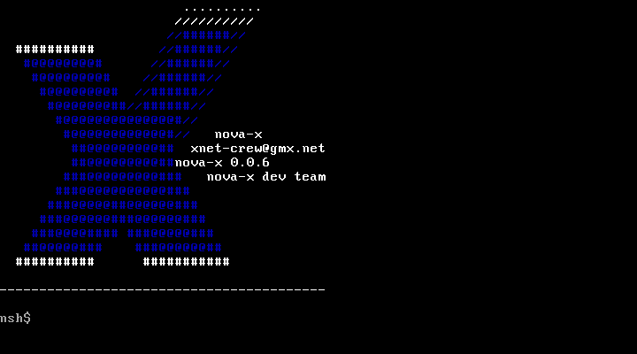
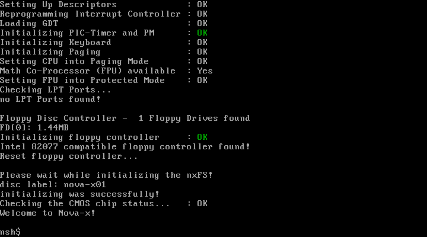
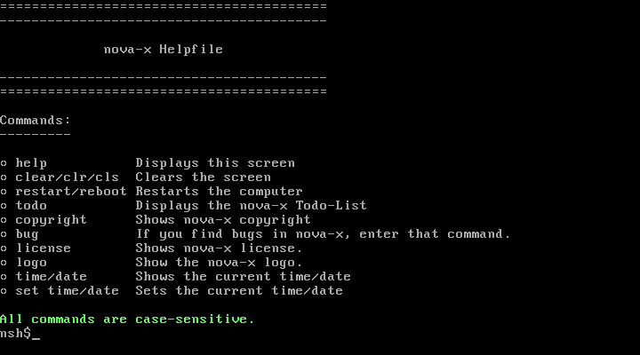
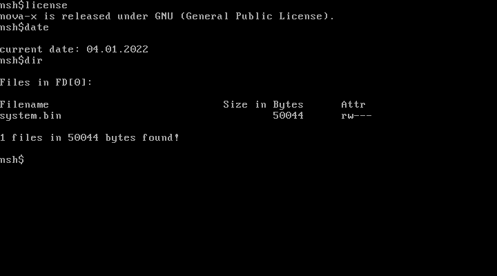

# Nova-X
## Introduction
Nova-X was an experimental operating system (OS) written by a group of young people between 2002 and 2003. The aim was to implement basic features of a modern protected mode operating system to learn and understand low-level hardware programming. The OS is mostly based on low-level assembler and C code. A working floppy disk image can be found in [nova-x-6200-win-cvs/novax.img](nova-x-6200-win-cvs/novax.img).

## Features
- Boot sector (bootable from a floppy disk)
- Protected mode environment
- Drivers: keyboard, floppy, PC speaker, LPT printer, CMOS, text console
- Input shell
- Memory management
- Direct memory access (DMA)
- Nova-X filesystem
- Exception handling

## Version
This is the latest known version (0.0.6 Build 6200 CVS) of Nova-X.

## Screenshots

- Nova-X Logo

- Boot process

- Built-in help screen

- Some commands in action

## License
This software is free software and published under the terms of the GNU General Public License (GPL) v2.0.
